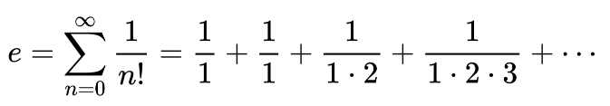

# Euler's number

The Euler's number is a mathematical constant approximately equal to 2.71828 which can be characterized in many ways. In this project is calculate the infinite series of Euler's number, it can be calculated as the sum of the infinite series.



## Getting started

You need to install in your compute Java 8 or latest version.

```shell
# Clone this repository
$ git clone <https://github.com/franklaercio/euler-concurrency-java.git>

# Go to the directory
$ cd euler-concurrency-java.git
```

## Considerations

The Euler number is calculated by an infinite series and as such is the infinite sum of 1 plus the factorial division of the terms. For this reason, there comes a time when, depending on the places of decimal divisions, this division tends to the number zero and that with the precision of 100 decimal places the highest value found is in the term number 69. <br><br>
In addition, as the factorial number is calculated recursively, another problem we had is when it reaches the factorial number of 15000, as it is no longer possible to calculate the factorial result given the limitations of the machine used for testing.

## Program versions

- The first one is a fixed thread pool. In this version you need to inform a number of thread pool.
- The seconf is a cached thread poll. In this version the Java controll all the recourses you need.
- The last is a work stealing pool. In this version you can run all thread in parallel for optimize processing.

## License

This project is licensed under the MIT License - see the LICENSE.md file for more information.